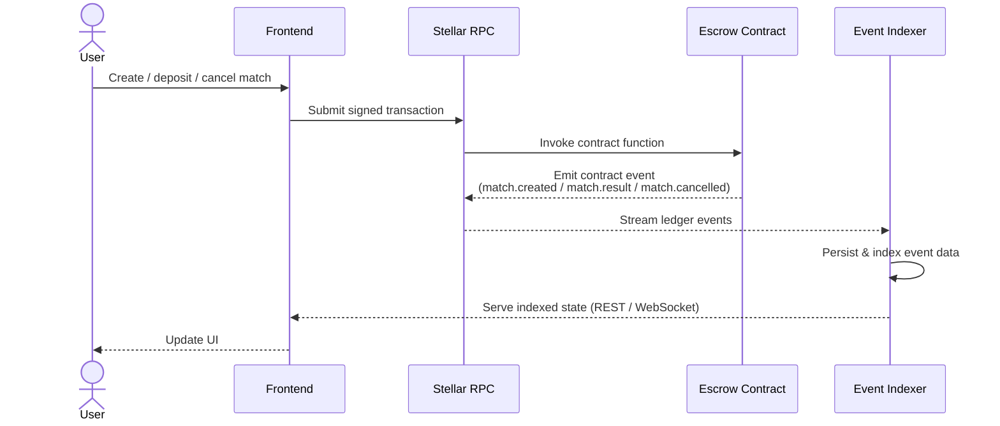
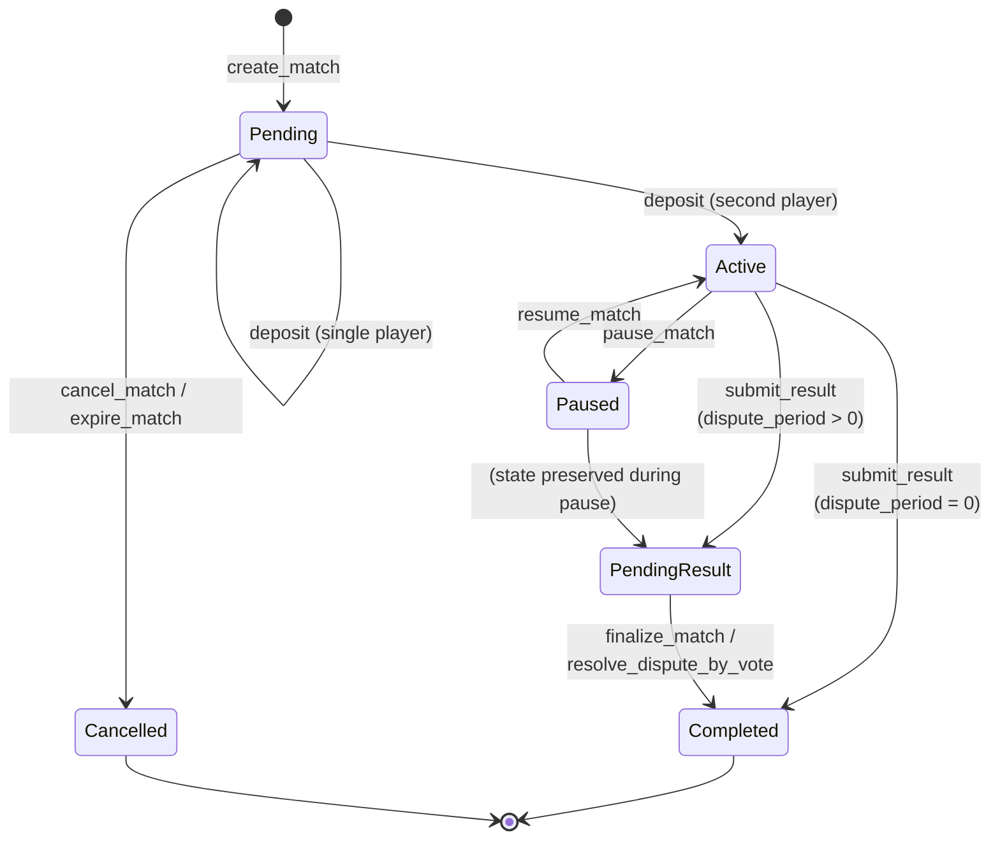

# Architecture Overview

Checkmate-Escrow is a trustless chess wagering platform built on Stellar Soroban smart contracts. This document describes the high-level architecture and the stable public API surface.

## Components

```
┌─────────────┐     create/deposit/cancel     ┌──────────────────┐
│   Players   │ ─────────────────────────────▶│  Escrow Contract │
└─────────────┘                               └────────┬─────────┘
                                                       │ submit_result
┌─────────────┐     verify game result                 │
│   Oracle    │ ─────────────────────────────▶─────────┘
└─────────────┘
      │
      │ polls
      ▼
┌──────────────────────┐
│  Lichess / Chess.com │
└──────────────────────┘
```

- **Escrow Contract** (`contracts/escrow`): Holds player stakes, enforces match lifecycle, and executes payouts.
- **Oracle Contract** (`contracts/oracle`): Bridges external chess platform APIs to the escrow contract, submitting verified match results on-chain.

## Event Flow



## Match Lifecycle

### State Machine Diagram



### Comprehensive Transition Reference

**Generated from formal specification: `/contracts/escrow/formal_spec.json`**

| From | To | Entry Point | Authorized Caller | Preconditions | Field Mutations | Key Errors |
|---|---|---|---|---|---|---|
| N/A | `Pending` | `create_match` | `player1` | Contract ¬paused; stake > 0; game_id unique; token allowed (if enforced); player1 ≠ player2; both players tier-compatible | id, player1, player2, stake_amount, token, game_id, platform, state=Pending, created_ledger | `ContractPaused`, `InvalidAmount`, `DuplicateGameId`, `InvalidGameId`, `InvalidPlayers`, `TokenNotAllowed` |
| `Pending` | `Pending` | `deposit` | player1 or player2 | Contract ¬paused; match exists; caller ¬deposited; tier-compatible | player1_deposited OR player2_deposited (one set true) | `ContractPaused`, `InvalidState`, `Unauthorized`, `AlreadyFunded` |
| `Pending` | `Active` | `deposit` | player1 or player2 | Same as Pending→Pending + both deposits now true | player1_deposited=true, player2_deposited=true, state=Active | (same as single deposit) |
| `Pending` | `Cancelled` | `cancel_match` | player1 or player2 | state == Pending | state=Cancelled, completed_ledger set | `InvalidState`, `Unauthorized` |
| `Pending` | `Cancelled` | `expire_match` | anyone | state == Pending; timeout elapsed since created_ledger | state=Cancelled, completed_ledger set | `InvalidState`, `MatchNotExpired` |
| `Active` | `PendingResult` | `submit_result` | oracle | state == Active; both deposited; dispute_period > 0 | state=PendingResult, PendingWinner stored, ResultDeadline set | `Unauthorized`, `InvalidState`, `NotFunded` |
| `Active` | `Completed` | `submit_result` | oracle | state == Active; both deposited; dispute_period == 0 | state=Completed, completed_ledger set, winner set, payout executed | `Unauthorized`, `InvalidState`, `NotFunded` |
| `Active` | `Paused` | `pause_match` | player1 or player2 | state == Active; ¬paused_ledger | state=Paused, paused_ledger set | `InvalidState`, `Unauthorized` |
| `Paused` | `Active` | `resume_match` | player1 or player2 | state == Paused | state=Active (restored), total_pause_duration += (current - paused_ledger), paused_ledger cleared | `InvalidState`, `Unauthorized` |
| `PendingResult` | `Completed` | `finalize_match` | anyone | state == PendingResult; dispute deadline elapsed; no active dispute | state=Completed, payout executed, PendingWinner cleared | `InvalidState`, `DisputePeriodNotElapsed` |
| `PendingResult` | `Completed` | `resolve_dispute_by_vote` | anyone | dispute.state == Active; voting deadline elapsed; tally votes | state=Completed, dispute resolved, payout/refund executed based on vote | `DisputeNotFound`, `VotingPeriodNotElapsed` |
| `PendingResult` | `PendingResult` | `dispute_oracle_result` | player1 or player2 | state == PendingResult; dispute deadline ¬elapsed; ¬dispute exists | Dispute record created, voting period set | `MatchNotInPendingResult`, `DisputeAlreadyRaised` |
| `Completed` | `Completed` | (none) | — | Terminal state | (no mutations) | (N/A) |
| `Cancelled` | `Cancelled` | (none) | — | Terminal state | (no mutations) | (N/A) |

### 6 Match States (Formal Specification)

| State | Reachable From | Terminal | Description |
|-------|---|---|---|
| `Pending` | N/A (initial) | No | Match created; awaiting both deposits |
| `Active` | Pending | No | Both players deposited; game in progress; awaiting result |
| `PendingResult` | Active | No | Oracle submitted result; awaiting dispute resolution or finalization deadline |
| `Completed` | Active, PendingResult | **Yes** | Payout executed; match settled |
| `Cancelled` | Pending | **Yes** | Cancelled before activation or expired; stakes refunded |
| `Paused` | Active, PendingResult | No | Match paused by player (vesting/timing paused) |

### Valid State Transitions (8 Total)

1. **Pending → Active** via `deposit()` when second player deposits
2. **Pending → Cancelled** via `cancel_match()` or `expire_match()`
3. **Active → PendingResult** via `submit_result()` with dispute_period > 0
4. **Active → Completed** via `submit_result()` with dispute_period = 0
5. **Active → Paused** via `pause_match()`
6. **Paused ↔ Active** via `resume_match()` (can pause/resume multiple times)
7. **PendingResult → Completed** via `finalize_match()` or `resolve_dispute_by_vote()`
8. **Completed → Completed** (self-loop for atomicity guarantees)

### Invalid Transitions (Properly Rejected)

The contract enforces state validation at every entry point. Invalid transitions include:
- Backward transitions (e.g., Completed → Active, Cancelled → Pending)
- Transitions from terminal states (except self-loops)
- Cross-tree jumps (e.g., Pending → Completed)

All invalid attempts return `InvalidState` error.

## Stable Public API

The following types and contract functions are considered stable. External integrations and tooling should rely only on these.

### `Match` Struct

Returned by `get_match(match_id)`. All fields below are stable and safe to read.

| Field              | Type            | Description |
|--------------------|-----------------|-------------|
| `id`               | `u64`           | Unique match identifier. |
| `player1`          | `Address`       | Match creator (first player). |
| `player2`          | `Address`       | Invited opponent (second player). |
| `stake_amount`     | `i128`          | Amount each player stakes, in the token's smallest unit. |
| `token`            | `Address`       | Token contract address used for staking (XLM or USDC). |
| `game_id`          | `String`        | External game ID from the chess platform. |
| `platform`         | `Platform`      | Chess platform: `Lichess` or `ChessDotCom`. |
| `state`            | `MatchState`    | Current lifecycle state (see below). |
| `winner`           | `Winner`        | Match outcome once completed; defaults to `Draw` until set. |
| `created_ledger`   | `u32`           | Ledger sequence at match creation. |
| `completed_ledger` | `Option<u32>`   | Ledger sequence at completion or cancellation, if applicable. |

> **Internal fields** — `player1_deposited` and `player2_deposited` are internal bookkeeping. Use `is_funded(match_id)` to check whether a match is fully funded.

### `MatchState` Enum

The contract uses a 6-state machine (formally verified at `/contracts/escrow/formal_spec.json`):

| Variant | Meaning | Terminal | Reachable From |
|---------|---------|----------|---|
| `Pending` | Match created; awaiting both deposits. | No | N/A (initial) |
| `Active` | Both players deposited; game in progress. | No | Pending |
| `PendingResult` | Oracle submitted result; awaiting dispute or finalization. | No | Active |
| `Completed` | Result verified and payout executed. | **Yes** | Active, PendingResult |
| `Cancelled` | Cancelled before activation or expired. | **Yes** | Pending |
| `Paused` | Match paused (vesting paused); can resume. | No | Active, PendingResult |

**Terminal State Guarantee:** Once a match reaches `Completed` or `Cancelled`, no further state changes are possible. These states are immutable and represent final settlement.

**Dispute/Voting Flow:** When `dispute_period > 0`, the `PendingResult` state allows players to dispute the oracle's result via voting before finalization. Vote tally determines whether result is upheld (→ `Completed`) or overturned (→ `Cancelled` as refund).

### `Winner` Enum

| Variant   | Meaning |
|-----------|---------|
| `Player1` | Player 1 won. |
| `Player2` | Player 2 won. |
| `Draw`    | Game ended in a draw; stakes returned to both players. |

### `SnapshotReason` Enum

| Variant     | Meaning |
|-------------|---------|
| `Created`   | Snapshot taken when match was created. |
| `Deposit`   | Snapshot taken after a player deposited. |
| `Completed` | Snapshot taken when match completed with payout. |
| `Cancelled` | Snapshot taken when match was cancelled. |

### `BalanceSnapshot` Struct

Balance snapshots provide an audit trail of a match's escrow balance at key lifecycle transitions. The contract uses a fixed-size ring buffer to store these records efficiently.

| Field              | Type            | Description |
|--------------------|-----------------|-------------|
| `match_id`         | `u64`           | The match this snapshot belongs to. |
| `index`            | `u32`           | Monotonically increasing position in the full chronological sequence. Storage keys are computed as `slot = index % MAX_SNAPSHOTS_PER_MATCH` (8). May have gaps if older snapshots were pruned. |
| `reason`           | `SnapshotReason`  | Lifecycle event that triggered the snapshot: `Created`, `Deposit`, `Completed`, or `Cancelled`. |
| `ledger`           | `u32`           | Ledger sequence at snapshot time. |
| `token`            | `Address`       | Token contract address used for staking. |
| `token_symbol`     | `String`        | Human-readable token symbol (e.g., "XLM", "USDC"). |
| `stake_amount`     | `i128`          | Per-player stake amount at snapshot time. |
| `escrow_balance`   | `i128`          | Total tokens held in escrow at snapshot time. |
| `player1_deposited`| `bool`          | Whether player1 had deposited. |
| `player2_deposited`| `bool`          | Whether player2 had deposited. |

### Balance Snapshots

Snapshots are recorded automatically at key lifecycle transitions:
- **`Created`** — when `create_match` is called (initial state: zero deposits)
- **`Deposit`** — each time a player deposits their stake
- **`Completed`** — when `submit_result` executes the payout
- **`Cancelled`** — when cancellation occurs (before or after activation)

The ring buffer has a fixed capacity of `MAX_SNAPSHOTS_PER_MATCH = 8` slots per match. Snapshots are stored at keys `DataKey::Snapshot(match_id, slot)` where `slot = index % MAX_SNAPSHOTS_PER_MATCH`. When the buffer fills, the oldest entry is silently overwritten — this is the storage-pruning mechanism.

**Interpreting the `index` field:** The `index` is monotonically increasing and never resets, enabling callers to detect when pruning has occurred. If `get_balance_snapshots` returns snapshots with indices like `[5, 6, 7, 8]`, you know snapshots `0` through `4` were pruned because only 8 slots are retained. The `SnapshotCount(match_id)` tracks the total ever recorded, allowing calculation of the actual sequence range.

### Contract Functions

#### Match Management

| Function | Signature | Description |
|----------|-----------|-------------|
| `create_match` | `(player1: Address, player2: Address, stake_amount: i128, token: Address, game_id: String, platform: Platform) -> u64` | Creates a new match and returns its ID. |
| `get_match` | `(match_id: u64) -> Match` | Returns the current state of a match. |
| `cancel_match` | `(match_id: u64)` | Cancels a match and refunds any deposits. |

#### Escrow

| Function | Signature | Description |
|----------|-----------|-------------|
| `deposit` | `(match_id: u64)` | Deposits the caller's stake into escrow. |
| `get_escrow_balance` | `(match_id: u64) -> i128` | Returns the total escrowed balance for a match. |
| `is_funded` | `(match_id: u64) -> bool` | Returns `true` when both players have deposited. |

#### Oracle & Payouts

| Function | Signature | Description |
|----------|-----------|-------------|

| `submit_result` | `(match_id: u64, winner: Winner)` | Oracle submits the verified match result. Payout (or draw refund) is executed atomically in the same transaction — there are no separate `verify_result` or `execute_payout` functions. |

#### Read Indexes

| Function | Signature | Description |
|----------|-----------|-------------|
| `get_player_matches` | `(player: Address) -> Vec<u64>` | Returns all match IDs (past and present) for a player. |
| `get_pending_matches` | `() -> Vec<Match>` | Returns pending matches currently in `Pending` state, awaiting deposit completion. |
| `get_active_matches` | `() -> Vec<Match>` | Returns active matches currently in `Active` state, fully funded and ready for result submission. |
| `get_pending_matches_paginated` | `(player: Address, offset: u32, limit: u32) -> Vec<Match>` | Paginated version of `get_pending_matches`. |
| `get_active_matches_paginated` | `(offset: u32, limit: u32) -> Vec<Match>` | Paginated version of `get_active_matches`. |

#### Balance Snapshot Queries

| Function | Signature | Description |
|----------|-----------|-------------|
| `get_balance_snapshots` | `(caller: Address, match_id: u64) -> Vec<BalanceSnapshot>` | Returns all retained snapshots for a match. Admin sees exact amounts; players see redacted amounts. |
| `get_latest_snapshot` | `(caller: Address, match_id: u64) -> BalanceSnapshot` | Returns the most recent snapshot for a match. Same access rules as `get_balance_snapshots`. |

## Index Behavior, TTL Caveats, and Pagination

### Player-Match Index (`get_player_matches`)

`get_player_matches` reads a `Vec<u64>` stored under `DataKey::PlayerMatches(player)` in persistent storage. The index is append-only: a match ID is added when `create_match` is called and is **never removed**, regardless of the match outcome. This means:

- The list grows monotonically over a player's lifetime.
- It includes `Completed` and `Cancelled` matches as well as live ones.
- To determine a match's current state, call `get_match(match_id)` for each ID.

### Pending-Match Query (`get_pending_matches`)

`get_pending_matches` scans all created matches and returns those currently in `Pending` state. A pending match has been created but has not yet reached full funding; it may have zero, one, or both deposits recorded, but it remains pending until the second player deposits.

### Active-Match Query (`get_active_matches`)

`get_active_matches` scans all created matches and returns those currently in `Active` state. An active match is fully funded and ready for result submission. It excludes pending, completed, and cancelled matches.

> **Note:** Because these query methods scan per-match storage, off-chain consumers should still verify a match's current state with `get_match(match_id)` before taking critical action.

### TTL Caveats

`get_player_matches` is a persistent append-only index stored under `DataKey::PlayerMatches(player)`. The index is updated on `create_match` and carries a TTL of `MATCH_TTL_LEDGERS` (~30 days at 5 s/ledger). If no matches are created or resolved for a player for ~30 days, that player-specific index may expire and `get_player_matches` can return an empty list.

`get_pending_matches` and `get_active_matches` are filtered getters that scan all `Match` records by state. They do not rely on separate persistent index entries and therefore reflect current match state directly from stored match data.

Individual `Match` records in persistent storage follow the same ~30-day TTL and are extended on every write to that match.

Off-chain indexers should not rely solely on these on-chain values for long-term history. Subscribe to contract events (`match.created`, `match.result`, `match.cancelled`) for a durable record.

### Pagination

`get_pending_matches` and `get_active_matches` return the full filtered result set in a single call. Use `get_pending_matches_paginated(player, offset, limit)` or `get_active_matches_paginated(offset, limit)` to fetch bounded pages of pending or active matches respectively.

`get_player_matches` also returns the full vector of match IDs for a player. For large player histories, apply client-side slicing on the returned `Vec<u64>`.

```rust
// Example: fetch page of 20 starting at offset 40
let all_ids = client.get_player_matches(&player);
let page: Vec<u64> = all_ids.iter().skip(40).take(20).collect();
```

## Glossary

> For the complete project glossary — escrow, oracle, match lifecycle states, Soroban, XLM, stake, payout, draw, wave-ready, `game_id`, allowlist, admin, epoch, ledger, Freighter, and more — see [docs/glossary.md](glossary.md). A few architecture-specific terms are summarized below.

- **Ledger**: A single batch of transactions finalized by the Stellar network. In this project, ledger sequence numbers are used to record when matches were created, completed, or cancelled, and to enforce time-based rules such as match expiry.
- **TTL**: Time-to-live, expressed in ledgers. In Soroban, TTL controls how long contract data remains valid in storage before it expires. The project uses ledger-based TTL values for match and index records.
- **Instance Storage**: Contract-level storage shared by a single deployed contract instance. It is used for configuration that should persist for the lifetime of the contract, such as the oracle address or other contract-wide settings.
- **Persistent Storage**: Long-lived contract data storage on-chain, retained across transactions until it expires or is overwritten. Match records, player indexes, and balance snapshots are stored here.
- **Oracle**: An authorized off-chain service or contract account that submits verified game outcomes to the escrow contract. In this system, the oracle is the trusted bridge between external chess-platform data and on-chain settlement.
- **Escrow**: The smart contract logic and funds that hold player stakes until a match reaches a terminal state. The escrow enforces the rules for deposits, cancellation, and payout settlement.
- **Match**: A single wagered chess game between two players. A match includes the participants, stake amount, token, game identifier, lifecycle state, and outcome information.
- **Payout**: The transfer of escrowed funds to the winning player after a match result is accepted, or the return of funds in a draw or cancellation scenario.
- **Wave**: A higher-level grouping or lifecycle concept in the project’s broader product model, referring to a batch of related match activity or coordinated release behavior in documentation and product discussions.

